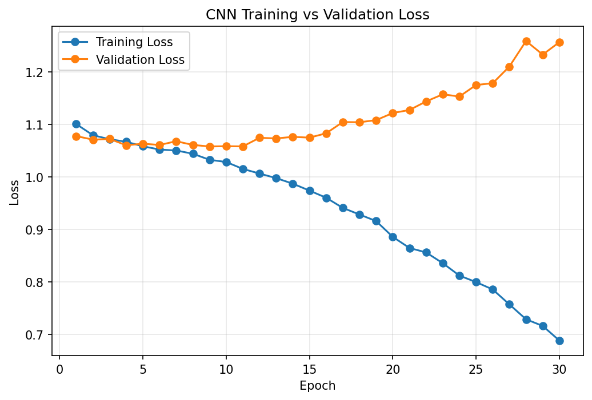
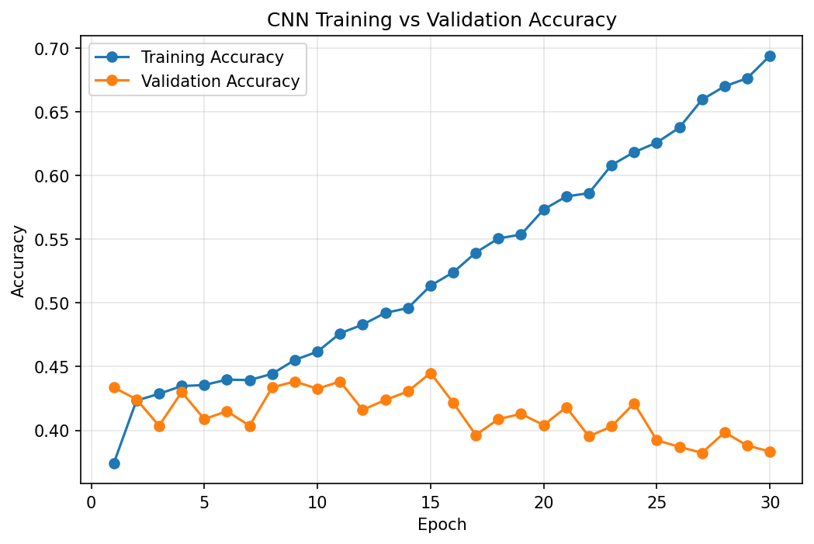
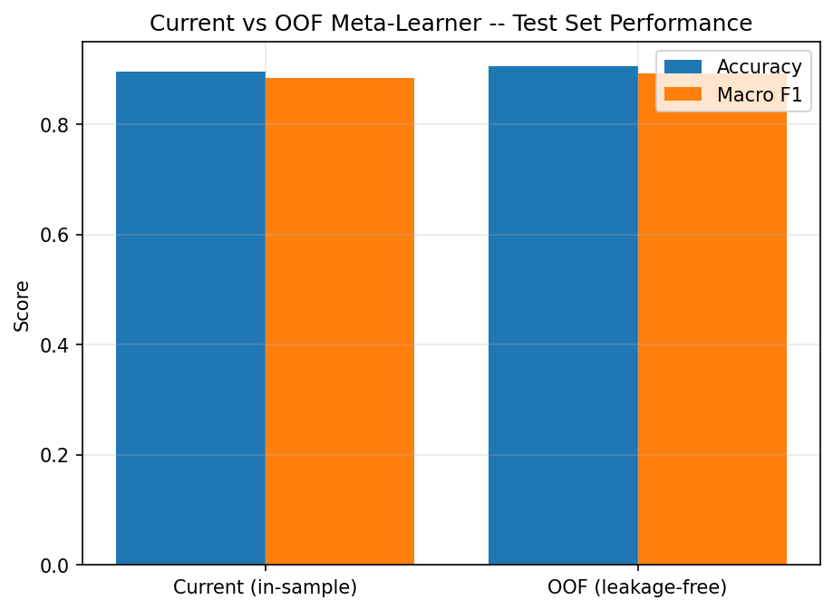

# Research gaps and current extensions

This document is the detailed counterpart to the "Research Gaps & Current
Extensions" section of the main [README](../README.md). It separates two kinds
of items:

- **Gaps identified through our own diagnostic experiments** on this
  reproduction (CNN overfitting, meta-learner leakage) — completed analyses
  with concrete numbers.
- **Gaps identified through critical reading of the paper's methodology**
  (hyperparameter search, validation strategy, explainability, in-play
  prediction) — planned directions, not yet implemented.

None of the "planned" items below should be read as already built. Where code
exists, it is named explicitly.

---

## Gap 1 — CNN overfitting

**What the paper does:** Reports a single CNN test accuracy (46.68%) with no
training/validation curves, so it is not possible to tell from the paper
whether the CNN generalises or memorises.

**What we did:** Trained the CNN for 30 epochs on a held-out validation split
and logged training/validation loss and accuracy at every epoch.

**Training vs. validation loss**


- Training loss decreases continuously and smoothly from ≈1.10 (epoch 1) to
  ≈0.69 (epoch 30) — the model is consistently reducing its error on data it
  has seen.
- Validation loss decreases only slightly at first, stays roughly flat between
  epochs 5–15 (≈1.05–1.08), and then **rises continuously** from around epoch
  10–15 onward, reaching ≈1.26 by epoch 30.

**Training vs. validation accuracy**

- Training accuracy rises steadily from ≈37% (epoch 1) to **69.4%** (epoch 30).
- Validation accuracy rises to a peak of **≈44.5% at epoch 15**, then
  generally *declines*, ending at **≈38.3%** by epoch 30 — barely above where
  it started.

**Interpretation:** Falling training loss with rising validation loss,
combined with rising training accuracy and falling validation accuracy, is the
standard joint signature of overfitting. The CNN keeps improving on the
training set while its ability to generalise to unseen matches deteriorates
past roughly epoch 15.

**Limitation / gap:** The paper gives no indication of monitoring this, and no
early-stopping criterion is stated in its methodology.

**Why it matters:** It explains — at least partially — why the CNN
underperforms both other base learners by such a wide margin (37.17% vs.
89–90% for XGBoost/BiLSTM). A CNN that overfits by epoch 15 but trains for 30
is being evaluated on a substantially degraded checkpoint.

**Possible direction (not yet applied to the production model):**

1. **Early stopping** — stop training around epoch 15, where validation
   accuracy peaked, instead of the paper's fixed 30 epochs.
2. **Dropout** — increase dropout strength so the network relies less on
   specific filters/neurons, which should narrow the train/validation gap.

These are proposed fixes, not implemented ones. `config.CNN_PARAMS["epochs"]`
is still `30` and dropout is still `0.3`, matching the paper. Feature
ordering, input representation, and network depth (`unspecified_details.md`
#4, #9) remain additional, unruled-out contributors to the CNN's weak
standalone performance.

---

## Gap 2 — Potential meta-learner training leakage (investigated, not confirmed)

**What the paper does:** Algorithm 1 trains the meta-learner on **in-sample**
base-model predictions — base models are trained on the full training set `D`,
then generate probabilities for that same `D`, which become the meta-learner's
training features (see `unspecified_details.md` #5, and Wolpert 1992, which
the paper cites but does not apply).

**Limitation / gap:** In-sample stacking can theoretically produce optimistic
meta-features, because base learners have partially memorised the samples
they're predicting on. This is a well-known risk in the stacking literature,
independent of anything specific to this paper.

**What we did:** Implemented an out-of-fold (OOF) variant — base learners
generate predictions only for samples outside their own training folds, and
the meta-learner is trained on those instead — and compared it to the
in-sample default on the same held-out test set.

| Approach | Test accuracy | Test macro F1 |
|---|---|---|
| Current (in-sample) | 89.60% | 88.38% |
| OOF (leakage-resistant) | 90.47% | — |
| Difference | +0.87 pts | — |

**Why it matters:** If in-sample training were inflating the reported
accuracy, we would expect the OOF variant to score *lower*. It scored
*higher* instead, though only by a small margin.

**Conclusion:** This single experiment does not provide clear evidence that
the in-sample approach causes material performance inflation. The gap is small
enough to be within normal run-to-run variation. **We are not claiming leakage
is proven, and we are not claiming it is ruled out** — only that this one test
did not surface it.

**Possible direction:** OOF training remains the methodologically safer
choice regardless of this result, since it removes a known theoretical risk at
negligible accuracy cost. It is already available via
`config.USE_OUT_OF_FOLD_META_FEATURES = True`; the paper-faithful in-sample
path stays the default because the brief is to reproduce the paper as
published.

---

## Gap 3 — Lack of dynamic in-play prediction

**What the paper does:** Produces one static, pre-match probability per match
and does not revisit it once the match starts.

**Limitation / gap:** Real matches are dynamic — goals, cards, substitutions,
and momentum shifts all change the likely outcome, and a purely pre-match
model cannot reflect any of that.

**Why it matters:** A live-updating model is materially more useful in
practice (e.g., for broadcast graphics or live analytics) and would test
whether the architecture's temporal component (the BiLSTM) can do real
sequential work — unlike its current single-timestep degenerate case (see
`unspecified_details.md` #2).

**Possible direction:** Treat a match as a time-ordered sequence of events
(goals, cards, penalties, substitutions, shots, possession changes). A
temporal model — a genuinely sequential BiLSTM, unlike the current one-timestep
configuration — could learn how event timing and combination shift the
outcome, producing a pipeline where:

```
Pre-match model → initial probability
Live events     → update match state
Live model      → recalculates probability whenever new information arrives
```

This is an unstarted, longer-term direction.

---

## Gap 4 — No systematic hyperparameter optimisation

**What the paper does:** States one fixed hyperparameter value per setting for
each model (e.g., XGBoost `max_depth: 6`, BiLSTM `hidden_units: 64`, CNN
`filters: 128`), with no ablation or search reported over alternatives.

**Limitation / gap:** There is no evidence these particular values are optimal
for this dataset specifically, as opposed to simply "reasonable defaults."

**Why it matters:** Both the CNN's weak standalone performance and the
ensemble's inability to beat XGBoost alone (`docs/results.md`, Table IV) could
plausibly be affected by suboptimal hyperparameters rather than purely
architectural limitations — the two are hard to separate without a search.

**Possible direction:** A systematic search using
[Optuna](https://optuna.org/), which searches the hyperparameter space guided
by validation performance rather than manual trial and error, over:

- **XGBoost:** `learning_rate`, `n_estimators`, `max_depth`, `subsample`,
  `colsample_bytree`, `min_child_weight`, `gamma`
- **BiLSTM:** `learning_rate`, hidden `units`, number of layers, `dropout`,
  `batch_size`, `epochs`
- **CNN:** `learning_rate`, `filters`, `kernel_size`, number of layers,
  `dropout`, `batch_size`, `epochs`

Not yet started.

---

## Gap 5 — Lack of chronological validation

**What the paper does:** Uses an 80:20 **stratified random** train/test split
over the full 2014–2020 dataset (`unspecified_details.md` #3).

**Limitation / gap:** Football matches occur in a strict time order. A random
split can place later matches (e.g., 2019–2020) in the training set while
earlier matches (e.g., 2014–2015) end up in the test set — the model can
effectively be evaluated on "the past," having trained partly on "the future."
This does not reflect the actual prediction task, where only information
available *before* a given match should be usable.

**Why it matters:** A model's real-world value is its ability to predict
matches that have not happened yet, using only what was known beforehand.
Random splitting can produce an accuracy estimate that does not reflect that
scenario.

**Possible direction:** Walk-forward (rolling-origin) validation, e.g.:

```
Train 2014–2017 → Test 2018
Train 2014–2018 → Test 2019
Train 2014–2019 → Test 2020
```

This would (a) preserve chronological order, (b) test genuine forward
prediction, (c) show whether performance holds steady across seasons rather
than being an artifact of the random split, and (d) give a more realistic
estimate of real-world generalisation. Not yet implemented; the random 80:20
split remains a valid standard ML split, just not the most representative one
for this time-dependent problem.

---

## Gap 6 — Lack of explainability

**What the paper does:** Reports only aggregate accuracy/F1 metrics. Nothing
in the paper, or in this reproduction, currently explains which features drove
an individual prediction.

**Limitation / gap:** For recruiters, researchers, or any real user, "the
model predicted Home Win" without a reason is of limited practical value, and
also makes it harder to sanity-check the model (e.g., to catch reliance on the
post-match leakage features flagged in `unspecified_details.md` #11).

**Why it matters:** Explainability is both a practical usability feature and a
diagnostic one — SHAP values on this dataset would likely make the
`Match Excitement` / team-rating leakage concern (Gap 2's neighbour issue,
documented separately in `unspecified_details.md` #11) directly visible as
disproportionately high-attribution features.

**Possible direction:** Integrate **SHAP** for per-prediction feature
attribution across the base models and/or the meta-learner, as groundwork for
the LLM-based reasoning direction below. Not yet implemented.

---

## Related, longer-term direction: LLM-based reasoning

Not a research gap in the paper itself, but the current longer-term goal of
this project: once SHAP attributions exist, use an LLM to translate
`(prediction, SHAP evidence)` into a plain-language explanation for a
non-technical reader. This is at the idea stage — no code, prompts, or
evaluation exist yet, and it should not be read as an implemented feature.
